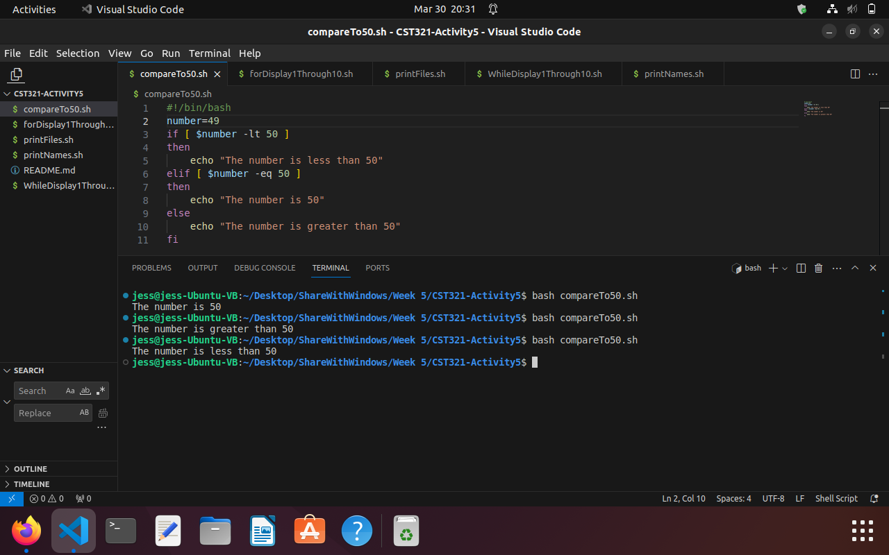
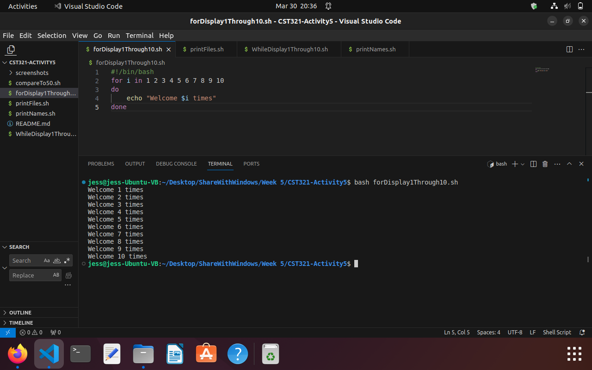
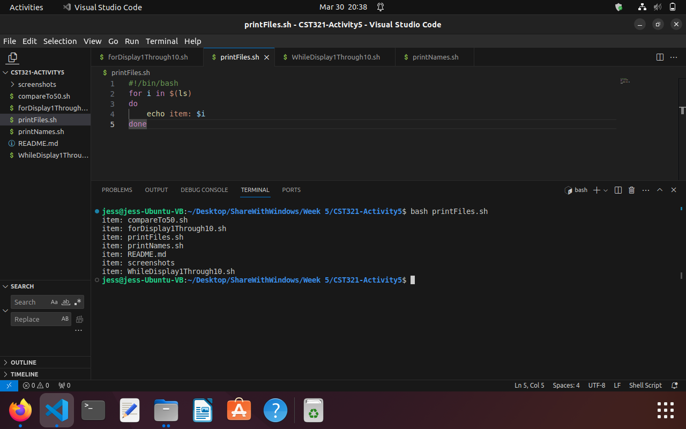
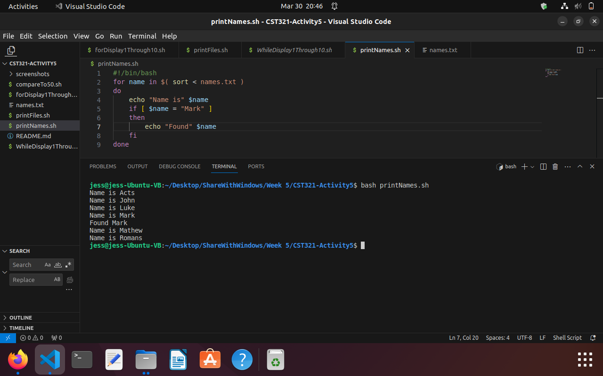

# CST321-Activity5
This activity is to practice using bash shell scripts to make decisions, perform loops, and work with files.

### Compare to 50
[compareTo50.sh](./compareTo50.sh) program uses if, elif, else to make a decision about what to print to the console.

### Use for loop to display numbers 1-10
[forDisplay1Through10.sh](./forDisplay1Through10.sh) program uses a for loop to display "Welcome _ times" to console.  It iterates 10 times.

### Print files
[printFiles.sh](/printFiles.sh) program uses for loop to iterate through all the elements in the ls list.  Each time a new ls element is selected, it is assigned to the variable i and then printed to console.

### Print names
[printNames.sh](./printNames.sh) program uses a for loop to sort each element from a txt file and then iterate over each element and assign the currently selected item to the variable 'name' and then print that currently selected item.  Also, if the name is 'Mark', then print 'Found Mark'.

### Research Northbridge and Southbridge
1. What are these bridges and what functions do they perform?
  - The northbridge is located toward the north of the motherboard and handles communication between the CPU and other parts of the motherboard.
  - The southbridge is located south of the PCI and handles most I/O. It uses the northbridge to connect to the CPU.
2. Why are there 2 bridges?
  - The northbridge serves as the gateway to the CPU.  The southbridge needs it to communicate to the CPU while the northbridge needs the southbridge to perform I/O functions.  By separating the functionality between them, there is better performance.
3. What I/O devices are handled in each bridge?
  - The northbridge performs quick actions between the CPU and other parts of the motherboard such as the graphics card.
  - The southbridge performs slower actions like communication through USB and hard drive.
4. Where do components like a DMA controller fit into the bridges?
  - The northbridge can tell the peripherals, like keyboards, monitors, or hard drives, to perform I/O functions asynchronously so that the CPU can continue processing its other processes without having to handle the copying or writing of files.
5. How are devices like a keyboard, mouse, network, and hard disk handled?
  - These are all functions that the southbridge can handle because they are relatively slow and don't require much interaction from the CPU until the device raises an interrupt when complete.  

References:

https://www.lenovo.com/us/en/glossary/northbridge/?orgRef=https%253A%252F%252Fwww.google.com%252F

https://www.geeksforgeeks.org/difference-between-north-bridge-and-south-bridge/
